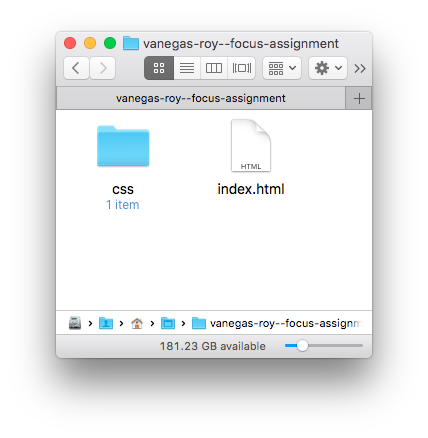

# The Focus Assignment

This assignment is designed to get you to produce a large project over a long period of time using everything you learn in this course. You’ll apply semantic HTML to content; employ CSS to style a design comp, and use a grid to translate the comp to a working web page.

Before reading any further, take a moment to inspect all the files and folders in this project.

## Description

You will create a transfer of [this Photoshop PSD](comps/focus.psd), created by Michael Reimer at [`bestpsdfreebies.com`](http://www.bestpsdfreebies.com/), into a web page. (The original is found [here](http://www.bestpsdfreebies.com/freebie/focus-psd-theme/).) The starter CSS, fonts, and assets you’ll need are discussed below.

## Grid

You will need [this Chrome extension](https://github.com/code-warrior/the-modular-grid) in order to transfer the page accurately using a web grid.

## Assets

All the images you’ll need are in the `img` folder and all the fonts you’ll need are in the `fonts` folder. You’ll want to use `comps/focus.jpg` as a background in your page to make sure you’re keeping true to the original design, and you’ll need `comps/focus.psd` to extract data related to colors, font sizes, leading, etc.

## Reset CSS

Eric Meyer’s reset CSS (`reset.css`) is provided in the `css` folder and included at the top of the style sheet stack in `index.html`.

## Fonts

The PSD comp `focus.psd` uses three typefaces: Pacifico, Raleway, and Helvetica Neue. The regular weight of Pacifico and the regular, light, and semibold versions of Raleway are included in the `fonts` directory. Helvetica Neue, however, isn’t included, since it’s not open. Try employing Helvetica Neue in the `font-family` property and fall back to Helvetica. The path to each font is listed below.

**Pacifico Regular**: `fonts/Pacifico/Q_Z9mv4hySLTMoMjnk_rCXYhjbSpvc47ee6xR_80Hnw.woff2`

**Raleway Regular**: `fonts/Raleway/QAUlVt1jXOgQavlW5wEfxQLUuEpTyoUstqEm5AMlJo4.woff2`

**Raleway Light**: `fonts/Raleway/-_Ctzj9b56b8RgXW8FAriQzyDMXhdD8sAj6OAJTFsBI.woff2`

**Raleway SemiBold**: `fonts/Raleway/xkvoNo9fC8O2RDydKj12bwzyDMXhdD8sAj6OAJTFsBI.woff2`

## Rules

- You may not rename any files.
- You may not resize any images.
- Use the hash sign (`#`) as the value to the `href` attribute in all anchors.

## What to Submit

Once you’re done with your project, **you will only submit `index.html` and `css/style.css`**. Create a folder with the name `LAST-NAME-FIRST-NAME--focus-assignment`, where `LAST-NAME` and `FIRST-NAME` are your last name and first name. Place your `index.html` file and your `css` folder containing `style.css` in this folder. My files, for example, would look like:

    vanegas-roy--focus-assignment/index.html
    vanegas-roy--focus-assignment/css/style.css

And my assignment folder would look like:

## Due

This assignment is due by 11:59 PM on Friday, 21 April 2017. We’ll discuss the submission protocol in class as the due date approaches.

